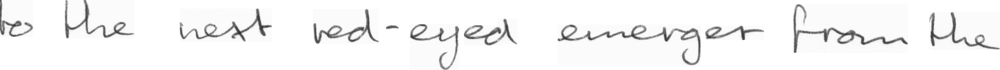

# Handwritten_Recognition

This is a handwritten recognition api. For current, it can detect line text from single line img. It used **Gated CNN** as encoder and **Multi head attention model** as decoder.


----


To improve it the following content could be done in future:

* add a language model to improve the detection text result, especially for german.
* add bounding box detector for line text, to make this api able to deal with paragraph text


----

## Installation

```
conda  create -n venv python=3.7

conda activate venv

pip install -r requirements.txt
```

----


## Model Architecture
1. Reshape all the input image with padding as shape (1,128,1024).#(channel,height,width)

2. This Model adopt **CNN and Gated CNN** as encoder to extract sequence features from input image. Change image from (1024,128,1) as sequence (1,128,128).

3. Build an **Multi head attention model** as feature decoder. This attention model is modified from [ALBert](https://github.com/huggingface/transformers/blob/master/transformers/modeling_albert.py), [which achieves the SOTA result on many language task with a way smaller model compared with Bert.](https://github.com/google-research/ALBERT).

4. Since the model is trained with [CTCLoss](https://pytorch.org/docs/stable/nn.html), the prediction logits from model need to be decoded with ctc_decode. Because there isn't available ctc_decode from pytorch now, therefore this api use the ctc_decode from tensorflow. Without decoding, it will have repeated  character in prediction result.

5. This model is very small checkpoints size is only 2.6MB. So it can run on any machine with fast speed.


----


## Training

* This model is only trained with [IAM handwritten dataset](http://www.fki.inf.unibe.ch/databases/iam-handwriting-database). For training, we used 8000 line images and 1000 line images for validate. It trained 800 Epoch with batch size of 150.  During training data augmentation is used to improve the model.

* Since the model is trained with limited English data. It may not works perfectly for other language and different scenario. Therefore a language model is needed for german text.

* Idea: we can use [ALBert](https://github.com/google-research/ALBERT) to train a language model in next step.

* To retrain the model, run script:

    ```
    python train_handwritten.py
    ```

----

## API Example:

  1. initial a detector model outside the repo folder

      ```
      from handwritten_recognition import HandWritten
      ```
      
      ```
      detector = HandWritten()
      ```

  2. do detection process

      ```
      text = detector.detect(img_path = "handwritten_recognition/images/r06-137-00.png")
      ```

----

## Result Example From test set of IAM

  
  ```
  result: 'The doorman turned his athentian'
  ```

  ----

  

  ```
  result: 'to the next red - eyed emerger from the'
  ```

  ----

  

  ```
  result: 'darke ; and we went an tvgether to'
  ```

  ----

  

  ```
  result: 'the future would depend . Outwardly she was calm , but'
  ```

  ----

  

  ```
  result: 'her heart was beating fast , an d the palms of her'
  ```

  ----

  

  ```
  result: 'ohn autocracy . Her squeaking , quermlons'
  ```

  ----

  

  ```
  result: 'aecents were heard without intr -'
  ```
